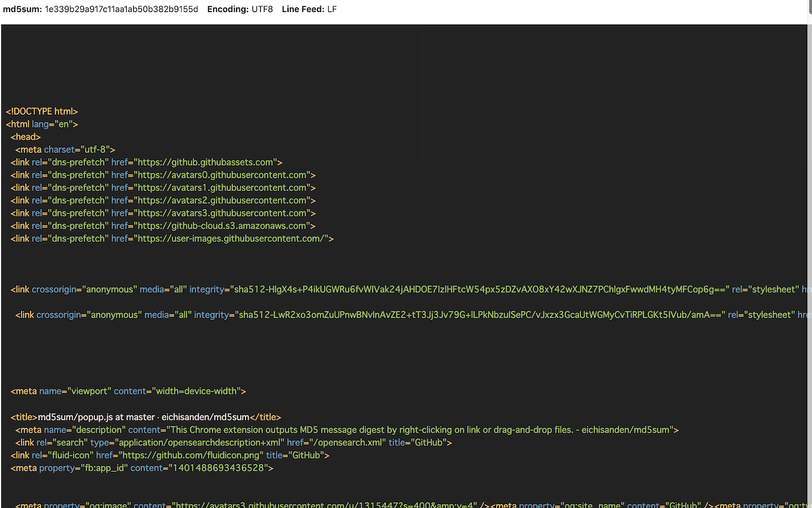
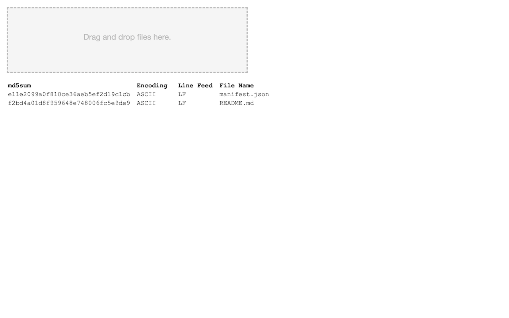

# md5sum

This chrome extension output md5 message digest by right-clicking on link or drag-and-drop files.

- Show md5sum, line-feed code, file encoding and file content from context menu.

- Show md5sum, line-feed code and file encoding by Drag-and-drop.

